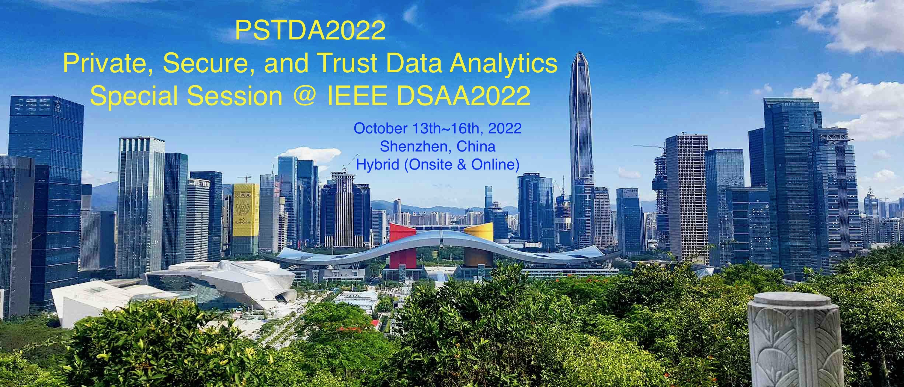

---
# Feel free to add content and custom Front Matter to this file.
# To modify the layout, see https://jekyllrb.com/docs/themes/#overriding-theme-defaults

layout: home
#layout: page
#title: PSTDA@DSAA2022
permalink: /

---
<!--  -->

	

 

Welcome to the DSAA2022 Special Session on Private, Secure, and Trust Data Analytics (PSTDA2022). It is a special session of the 9th IEEE International Conference on Data Science and Advanced Analytics ([DSAA2022](http://dsaa2022.dsaa.co)), which will be hybrid (onsite and online) event taking place at Shenzhen, China, during October 13th - 16th, 2022.

 

 The fusion of scalable computing infrastructure, big data, and artificial intelligence has boosted the development and application of data science and advanced data analytics. However, the recently emerging threats on the privacy, security, and trust (PST) of the data and the analytics models have shown a dramatically increasing trend with the wide deployment of data analytics applications. 
 

 

 This special session mainly focuses on the discussions of privacy, security, and trust in data analytics, which generally covers (but not limited to) the topics in privacy-preserving technology, privacy attacks, federated learning, machine unlearning, data poisoning attacks, model evasion attacks, adversarial learning, model robustness, secure machine learning integrating cryptographic techniques, blockchain techniques protection PST of data and models, etc. This special session invites authors to submit original research work that demonstrate and explore current advances in all related areas mentioned above. High-quality accepted papers will be recommended to the associated journal special issues (see more details in <a href="https://xuyun-zhang.github.io/pstda2022/cfp/">Call for Papers</a>. 

 

	

